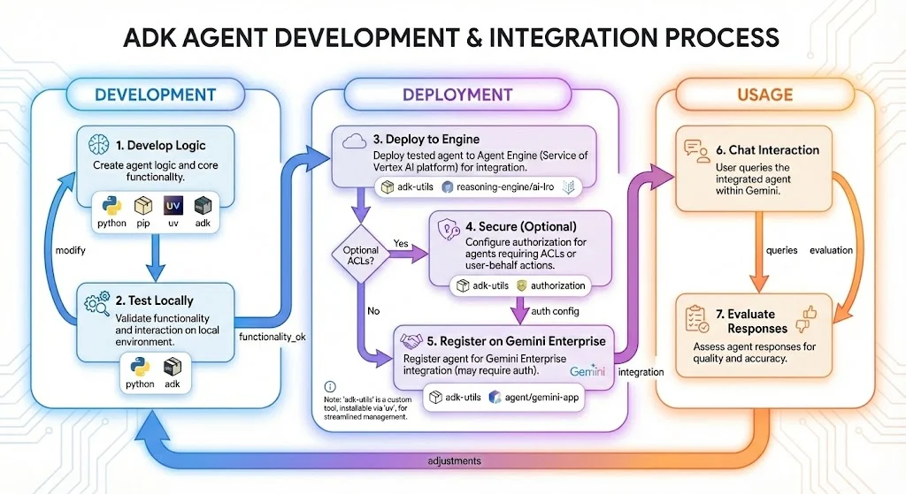

# adk-utils

## Introduction

This is a CLI utility to manage: 
- Reasoning/Agent engine agents. i.e. deploy from source ADK agent to Agent Engine
- Discovery Engine authorizations
- Gemini Enterprise agents
- Vertex AI long running operations


Workflow:



It is mainly a wrapper around REST methods for those functionalities, using these libraries:
- [Requests](https://requests.readthedocs.io/en/latest/) to execute http methods
- [Cyclopts](https://github.com/BrianPugh/cyclopts), to easily convert Python functions into CLI commands
- [Rich](https://github.com/Textualize/rich), to list items in table format, instead of a raw JSON dump

## How to use

For regular use, execute this "uv tool install":

`uv tool install git+https://github.com/aalfonzo123/adk-utils`

For occasional use, uvx works:

`uvx --from git+https://github.com/aalfonzo123/adk-utils adk-utils`

See also: [uv tools documentation](https://docs.astral.sh/uv/guides/tools/#requesting-different-sources)

## Cheat sheet

All commands are available under the `adk-utils` entry point.

### Agent Management (`agent`)

Commands for managing Agents in Google Cloud Discovery Engine.

#### `adk-utils agent create-or-update`

Registers or updates an agent with Agentspace.

**Usage:**
```bash
adk-utils agent create-or-update <project_id> <location> <gemini_app_id> <display_name> <description> <tool_description> <reasoning_engine_id> <reasoning_engine_location> [OPTIONS]
```

**Positional Arguments:**
- `project_id`: The Google Cloud project ID.
- `location`: The Google Cloud location for the Agentspace resources.
- `gemini_app_id`: The ID of the Gemini app (Discovery Engine engine).
- `display_name`: The display name of the agent.
- `description`: The description of the agent for the user.
- `tool_description`: The description of the agent for the LLM.
- `reasoning_engine_id`: The ID of the reasoning engine endpoint.
- `reasoning_engine_location`: The Google Cloud location where the ADK deployment (reasoning engine) resides.

**Options:**
- `--auth-ids TEXT`: A list of authorization resource IDs. (Can be specified multiple times)
- `--icon-uri TEXT`: The public URI of the agent's icon.
- `--existing-agent-id TEXT`: The ID of an existing agent to update.

---

#### `adk-utils agent delete`

Deletes an agent from Agentspace.

**Usage:**
```bash
adk-utils agent delete <project_id> <location> <gemini_app_id> <agent_id>
```

**Positional Arguments:**
- `project_id`: The Google Cloud project ID.
- `location`: The Google Cloud location for the Agentspace resources.
- `gemini_app_id`: The ID of the Gemini app (Discovery Engine engine).
- `agent_id`: The ID of the agent to delete.

---

#### `adk-utils agent list`

Lists all agents for a given Gemini App.

**Usage:**
```bash
adk-utils agent list <project_id> <location> <app_id>
```

**Positional Arguments:**
- `project_id`: The Google Cloud project ID.
- `location`: The Google Cloud location for the Agentspace resources.
- `app_id`: The ID of the Gemini app (Discovery Engine engine).

---

### Authorization Management (`authorization`)

Commands for managing Authorizations in Google Cloud Discovery Engine.

#### `adk-utils authorization create`

Creates a new authorization.

**Usage:**
```bash
adk-utils authorization create <project_id> <location> <auth_id> <client_id> [OPTIONS]
```

**Positional Arguments:**
- `project_id`: The Google Cloud project ID.
- `location`: The Google Cloud location for the Discovery Engine resources.
- `auth_id`: The ID for the new authorization.
- `client_id`: The OAuth 2.0 client ID.

**Options:**
- `--client-secret`: The OAuth 2.0 client secret (will be prompted for).
- `--base-auth-uri TEXT`: The base URI for the authorization server. (Default: `https://accounts.google.com/o/oauth2/v2/auth`)
- `--token-uri TEXT`: The URI for the token server. (Default: `https://oauth2.googleapis.com/token`)
- `--scopes TEXT`: A list of OAuth 2.0 scopes. (Default: `https://www.googleapis.com/auth/cloud-platform`, `openid`)
- `--format-raw`: If True, prints the raw JSON data.

---

#### `adk-utils authorization delete`

Deletes an authorization.

**Usage:**
```bash
adk-utils authorization delete <project_id> <location> <auth_id>
```

**Positional Arguments:**
- `project_id`: The Google Cloud project ID.
- `location`: The Google Cloud location for the Discovery Engine resources.
- `auth_id`: The ID of the authorization to delete.

---

#### `adk-utils authorization list`

Lists all authorizations for a given project and location.

**Usage:**
```bash
adk-utils authorization list <project_id> <location> [OPTIONS]
```

**Positional Arguments:**
- `project_id`: The Google Cloud project ID.
- `location`: The Google Cloud location for the Discovery Engine resources.

**Options:**
- `--format-raw`: If True, prints the raw JSON data.

---

### Gemini App Management (`gemini-app`)

Commands for managing Gemini Apps (Discovery Engine Engines).

#### `adk-utils gemini-app list`

Lists all Gemini Apps for a given project and location.

**Usage:**
```bash
adk-utils gemini-app list <project_id> <location>
```

**Positional Arguments:**
- `project_id`: The Google Cloud project ID.
- `location`: The Google Cloud location for the Discovery Engine resources.

---

### Reasoning Engine Management (`reasoning-engine`)

Commands for managing Reasoning Engines in Google Cloud AI Platform.

#### `adk-utils reasoning-engine deploy-from-source`

Deploys a reasoning engine from a local source directory.

Before executing this command, make sure that:
- There is a requirements.txt in the agent directory. Use "uv pip freeze > agentdir/requirements.txt" or similar
- There are no "editable mode" lines in the requirements.txt file, the ones that start with "-e". Those will make the deployment fail with a "does not appear to be a Python project" error.

**Usage:**
```bash
adk-utils reasoning-engine deploy-from-source <project_id> <location> <source_dir> <name> <display_name> [OPTIONS]
```

**Positional Arguments:**
- `project_id`: The Google Cloud project ID.
- `location`: The Google Cloud location for the reasoning engine.
- `source_dir`: The path to the local directory containing the source code.
- `name`: The name of the reasoning engine.
- `display_name`: The display name of the reasoning engine.

**Options:**
- `--entrypointModule TEXT`: The Python module containing the entrypoint. (Default: `agent`)
- `--entrypointObject TEXT`: The object within the entrypoint module to be invoked. (Default: `root_agent_adk`)
- `--requirementsFile TEXT`: The name of the requirements file. (Default: `requirements.txt`)
- `--pythonVersion TEXT`: The Python version to use. (Default: `3.12`)
- `--process-env-file / --no-process-env-file`: Excludes the .env file from the tarball, and includes its contents in the deployment definition. (Default: `True`)
- `--existing-agent-engine-id TEXT`: The ID of an existing Agent Engine to redeploy.

---

#### `adk-utils reasoning-engine delete`

Deletes a reasoning engine.

**Usage:**
```bash
adk-utils reasoning-engine delete <project_id> <location> <agent_engine_id> [OPTIONS]
```

**Positional Arguments:**
- `project_id`: The Google Cloud project ID.
- `location`: The Google Cloud location for the AI Platform resources.
- `agent_engine_id`: The ID of the reasoning engine to delete.

**Options:**
- `--force`: If True, forces the deletion of the reasoning engine.

---

#### `adk-utils reasoning-engine list`

Lists all reasoning engines for a given project and location.

**Usage:**
```bash
adk-utils reasoning-engine list <project_id> <location>
```

**Positional Arguments:**
- `project_id`: The Google Cloud project ID.
- `location`: The Google Cloud location for the AI Platform resources.

---

### AI Platform LRO Management (`ai-lro`)

Commands for managing AI Platform Long-Running Operations (LROs).

#### `adk-utils ai-lro follow`

Follows the status of a specific LRO until it completes.

**Usage:**
```bash
adk-utils ai-lro follow <project_id> <location> <reasoning_engine_id> <lro_id>
```

**Positional Arguments:**
- `project_id`: The Google Cloud project ID.
- `location`: The Google Cloud location for the AI Platform resources.
- `reasoning_engine_id`: The ID of the reasoning engine.
- `lro_id`: The ID of the long-running operation to follow.

---

#### `adk-utils ai-lro list`

Lists the most recent LROs for a given project and location.

**Usage:**
```bash
adk-utils ai-lro list <project_id> <location>
```

**Positional Arguments:**
- `project_id`: The Google Cloud project ID.
- `location`: The Google Cloud location for the AI Platform resources.

